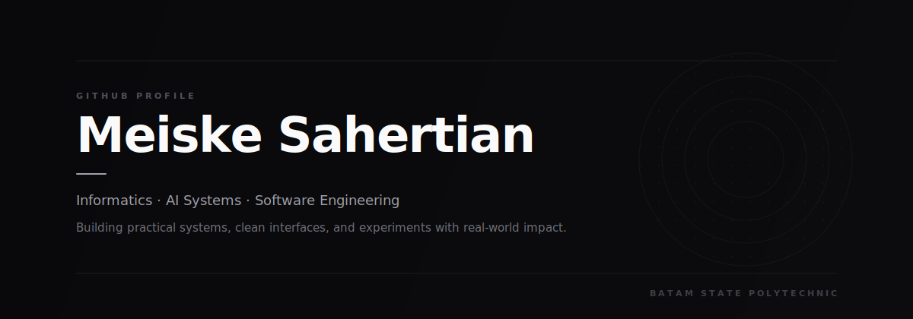
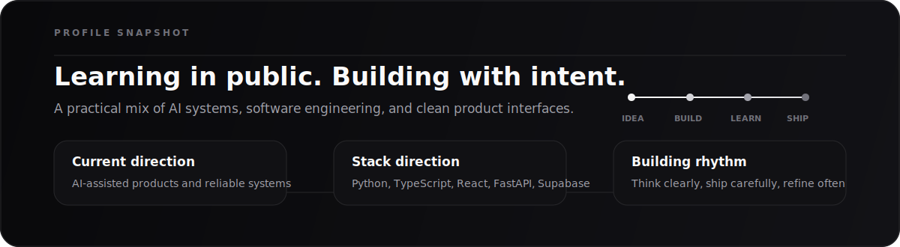

  
  

### About me

Informatics student focused on AI systems, software engineering, and product-minded development. I like turning ideas into useful products with clear data flow, reliable behavior, and clean interfaces.

  
<strong>How I think about building software</strong>

   
  <table>
    <tr>
      <td><strong>Think</strong></td>
      <td>Start from the problem, user flow, constraints, and the smallest useful version worth shipping.</td>
    </tr>
    <tr>
      <td><strong>Build</strong></td>
      <td>Turn rough ideas into working systems with clear data flow, readable code, and practical interfaces.</td>
    </tr>
    <tr>
      <td><strong>Refine</strong></td>
      <td>Improve reliability, polish the experience, and learn from each iteration instead of stopping at "it works".</td>
    </tr>
  </table>

### Current focus

- Building practical AI-assisted products and learning how to ship them well.
- Strengthening fundamentals in software architecture, clean code, and data flow.
- Designing interfaces that are simple to use, polished, and meaningful.
- Studying how large-scale systems stay reliable as they grow.

### Tech I use and explore

  
  
  
  
  
  
  
  
  
  

### GitHub snapshot

  

### Let's build something meaningful

I am always learning, building, and refining the craft. If you are working on AI, education, productivity, or software that helps people solve real problems, I would love to connect.
